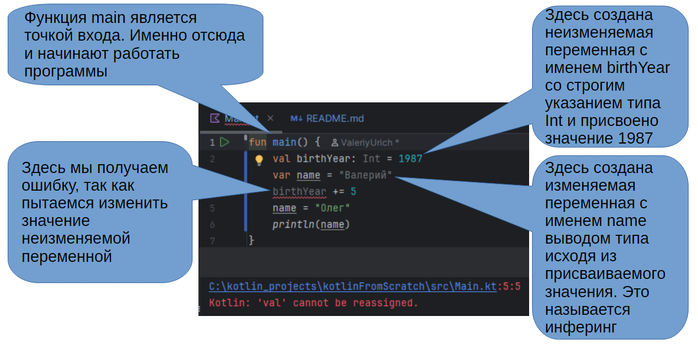

<h1 id="start">Kotlin для начинающих</h1>

 <a href="#modul_1">Приветственные слова автора</a>
 <a href="#modul_2">Введение</a>
 <a href="#modul_3">Переменные и типы</a>
 <a href="#modul_4">Условные операторы</a>
 <a href="#modul_5">Операторы повторения (циклы)</a>
 <a href="#modul_6">Функции и списки</a>
 <a href="#modul_7">Классы и null-safety</a>

<h2 id="modul_1">Приветственные слова автора</h2>

Привет. Этот курс создан для того чтобы старт твоей работы в нашей компании было максимально комфортным.  
Здесь ты найдёшь описание базовых конструкций языка Kotlin. Описание снабжено схемами, примерами кода, а так же заданиями, которые помогут тебе закрепить полученные знания на практике.  
Я буду рад, если ты напишешь мне в корпоративном мессенджере, если у тебя появятся вопросы и предложения по курсу.  
Кроме того, если у тебя появятся затруднения с задачами из курса, тоже не стесняйся написать мне.  
Чтобы курс считался пройденным тебе нужно решить все задачи в курсе. Для этого создай свой репозиторий с клоном этого проекта. Сдать очередную задачу можно через pull request адресованный мне.  
 <b>Желаю успеха!</b> 

 <a href="#start">Вернуться в начало</a>

<h2 id="modul_2">Введение</h2>

<b>Kotlin</b> — современный язык программирования, созданный компанией JetBrains. 
Его разработка началась в начале 2010‑х как ответ на потребность в более безопасном и удобном языке для JVM-проектов.
В 2016 году вышла версия 1.0, а в 2017 Google объявила Kotlin официально поддерживаемым языком для Android-разработки.
С этого момента он стал фактическим стандартом для новых Android-приложений.

Главные причины популярности Kotlin у начинающих: лаконичный синтаксис, меньше шаблонного кода, 
встроенная защита от NullPointerException (null-safety), удобные расширения (extension functions) 
и совместимость с Java — можно постепенно добавлять Kotlin в существующий проект. 

Перспективы языка связаны не только с Android. Kotlin активно развивается для серверной разработки (Ktor, Spring), 
для десктопа и кроссплатформенных приложений через Kotlin Multiplatform, 
где часть логики можно переиспользовать между Android и iOS.  
На практике Kotlin чаще всего применяют для Android UI и бизнес-логики, 
работы с сетью и базой данных, а также для написания библиотек и SDK.

<h3>Вопросы для самоконтроля</h3>
<ul>
<li>Кто создал Kotlin и зачем он был нужен?</li>
<li>Какие возможности Kotlin помогают избегать ошибок с null?</li>
<li>В чем преимущество совместимости Kotlin с Java?</li>
<li>Где кроме Android используется Kotlin?</li>
</ul>
 
 <a href="#start">Вернуться в начало</a>

<h2 id="modul_3">Переменные и типы</h2>

Понимание переменных и типов - это фундамент для создания приложений на платформе Android. Ключевая особенность Kotlin — строгая типизация и поддержка null-безопасности. Она позволяет минимизировать ошибки, связанные с неправильным использованием памяти и данных, что обеспечивает высокое качество конечного продукта.

<b>Переменная</b> - это именованная область памяти, предназначенная для хранения значений различных типов. 
Все переменные должны быть объявлены с указанием типа или полагаться на тип, выводимый компилятором. 
В Kotlin предусмотрены две категории переменных: изменяемые <code>var</code> и неизменяемые <code>val</code>.

Конструкция <code>val</code> используется для объявления констант, значения которых нельзя изменить после инициализации. 
Это способствует стабильности и безопасности кода, минимизируя непреднамеренные изменения.   
Например, <code>val birthYear = 1987</code> фиксирует год рождения. В противоположность этому, 
<code>var</code> объявляет изменяемую переменную, значение которой может меняться во время выполнения программы, 
как в случае <code>var score = 100</code>. Выбор между <code>val</code> и <code>var</code> определяется логикой  
приложения и необходимостью изменяемости данных.

Kotlin предоставляет разнообразие базовых типов данных для эффективной  
работы с информацией. Тип Int оптимален для целочисленных значений,  
обеспечивая баланс между производительностью и памятью. Double и Float  
предназначены для чисел с плавающей точкой, где Double обеспечивает большую точность, а Float — экономию памяти. Логические операции работают с типом Boolean, принимающим значения true или false. Для текстовых данных используются Char для одиночных символов и String для последовательностей символов, что является основой для любой работы с текстом.

Одним из отличительных достоинств Kotlin является механизм инференции типов - 
компилятор автоматически выводит тип переменной на основе присвоенного значения. 
Этот подход сокращает количество явных объявлений и упрощает код, сохраняя при этом строгую типизацию. 
Например, <code>val name = "Валерий"</code>  позволяет компилятору понять, что name — это String. 
Это повышает удобство разработки и снижает вероятность ошибок, обеспечивая эффективную автоматизацию типизации.

В переменные могут объявляться с явным указанием типа, что улучшает  
читаемость и гарантирует точность, особенно в сложных API. Например, <code>val height: Double = 1.80</code> четко фиксирует тип Double. Иначе можно полагаться на инференцию, как в случае `val city = "Таганрог"`, когда компилятор самостоятельно определяет тип из контекста. Явные объявления бывают необходимы, когда тип должен строго коррелировать с логикой приложения или отличаться от типа присвоенного значения.

Ещё одна особенность Kotlin - встроенная поддержка nullable-типов, обозначаемых знаком вопроса, 
например <code>String?</code>. Такие переменные могут  
содержать null, расширяя возможности обработки данных. Важной практикой  
является обязательная проверка значения на null перед использованием, 
что препятствует возникновению распространенной ошибки NullPointerException, традиционной для Java. 
Это обеспечивает повышенную надежность и качество кода, снижая количество багов.

Рассмотрим простые примеры объявления переменных в:

<ul>
<li><code>val year = 1987</code> — неизменяемая переменная типа Int, значение которой фиксируется навсегда </li>
<li><code>var counter = 0</code> — изменяемая Int-переменная, пригодная для счетчиков</li>
<li><code>val price: Double = 19.99</code> — явное указание типа Double при присвоении цены</li>
<li><code>var city: String? = null</code> — nullable-строка, допускающая хранение значения null,
демонстрирующая возможности безопасной работы с отсутствующими данными.
</li>
</ul>

### Задача 1

Объявить переменные различных типов, используя принципы Kotlin. Создать неизменяемую переменную для числового значения, изменяемую для текста и nullable переменную для данных, которые могут отсутствовать.

### Задача 2

Объявить переменную userEmail типа <code>String?</code> со значением null и применить оператор безопасного вызова `?.`, чтобы использовать её только при наличии значения.

Знакомство с переменными и типами данных в Kotlin является основой для  
написания безопасного и поддерживаемого Android-кода. Строгая типизация,  
неизменяемость значений благодаря val и продуманная работа с nullable типами  
значительно уменьшают количество ошибок и делают приложения более  
надежными, эффективными и удобными в сопровождении.

 <a href="#start">Вернуться в начало</a>

<h2 id="modul_4">Условные операторы</h2>

Условные операторы — важнейший элемент программирования. Эти инструменты
позволяют менять поведение программ в зависимости от различных условий,
делая логику приложений более отзывчивой. Далее речь пойдет о ключевых
конструкциях и их практическом применении в контексте разработки приложений на Kotlin.

<h3>if — базовый условный оператор в Kotlin</h3>

В Kotlin оператор if служит основой для создания логических ветвлений. Он
проверяет заданное булево условие и выполняет конкретный блок кода, если
условие истинно, что позволяет гибко управлять потоком выполнения программы.
Особенность Kotlin в том, что if — не просто оператор, а выражение, которое
может возвращать значение, что как тернарный оператор. Конструкции else и else if расширяют его возможности,
обеспечивая полноценную обработку альтернативных сценариев и глубокое
вложение логики, необходимое в сложных приложениях.

Ветвление логики делает if-else незаменимым для Android-разработчика.
Например, в пользовательских формах if-else проверяет
корректность данных, возвращая сообщения об ошибках или продолжая
обработку, если данные валидны. В задачах управления состояниями UI
конструкции if-else переключает отображение элементов в зависимости от
состояния пользователя или сетевого подключения, обеспечивая динамичное и
отзывчивое поведение приложения.

<h3>Оператор when — расширенная альтернатива if-else</h3>

Оператор <b>when</b> - это элегантное решение, заменяющее цепочки <b>if-else</b>, когда они становятся громоздкими. 
Он позволяет проверять значения переменных на множество вариантов, что
улучшает читаемость и упрощает поддержку кода. <b>When</b> поддерживает разные
типы проверок: конкретные значения, числовые диапазоны и типы объектов,
делая ветвление гибким и мощным. Кроме того, возможно использование
пользовательских предикатов, расширяющих стандартную логику. Как и <b>if</b>, <b>when</b>
возвращает значение, благодаря чему его удобно использовать в присваиваниях
и выражениях, что способствует лаконичности кода.

<h3>Тернарный оператор в Kotlin: альтернатива if-else</h3>

Хотя в Kotlin отсутствует традиционный <b>тернарный оператор</b>, его роль
эффективно выполняет конструкция if как выражение. Это обеспечивает
лаконичное и понятное написание кода, исключая необходимость отдельного
синтаксиса для выбора между значениями. Таким образом, язык Kotlin предлагает
единый и читаемый подход к условным выражениям, упрощая разработку и
поддержку приложений.

Идея для задачи!!!!! Одна из частых задач — проверить, не пусто ли поле ввода. При пустом значении
пользователь получает соответствующее сообщение об ошибке, что
предотвращает дальнейшую обработку некорректных данных. Если ввод
корректен, данные отправляются для дальнейшей обработки, обеспечивая
плавный пользовательский опыт и исключая возникновение ошибок, связанных с
неправильным вводом. Этот простой пример иллюстрирует важность условных
операторов в обеспечении надёжности приложений.

Логические операторы <code>&&</code>, <code>||</code> и <code>!</code> широко используются в Kotlin для комбинирования
и инвертирования условий, что позволяет строить сложные проверки в if и when.
Это особенно важно при реализации авторизации, управления правами
пользователей и состояниями интерфейса, где приходится учитывать множество
факторов одновременно. Чёткая логика Boolean выражений обеспечивает
стабильность и безопасность работы приложений, улучшая читаемость и
поддержку кода.

<h3>Ошибки при использовании условных операторов у новичков</h3>

Новички часто забывают включать ветку else, что приводит к непредсказуемому
поведению программы при ложных условиях if. Также распространены ошибки в
построении сложных логических выражений с && и ||, а неправильное
использование операторов сравнения == и === вызывает конфликты.
Необработанные null-значения и игнорирование граничных случаев
оборачиваются в баги, поэтому важно тщательно тестировать и продумывать все
возможные ветви условий.

Идея для задачи!!!!!!!! Для закрепления материала рекомендуется создать функцию с if для проверки
возраста пользователя, реализовать обработчик действий кнопок с when для
выбора действия, использовать выражение if для выбора цвета или текста в UI, и
разработать сценарий с вложенными условиями в Activity для обработки
различных состояний пользователя и интерфейса. Эти задания помогут углубить
понимание и освоить практическое применение условных операторов.

<h3>Ключевые выводы и рекомендации для практики</h3>

Условные операторы if, when и их аналоги в Kotlin — это фундаментальные и
мощные инструменты для управления логикой в Android-приложениях. Освоение
их особенностей и практическое применение через анализ и написание примеров
позволяет создавать качественный, чистый и эффективный код, что
непосредственно влияет на стабильность и удобство использования мобильных
решений.

 <a href="#start">Вернуться в начало</a>

<h2 id="modul_5">Операторы повторения (циклы)</h2>

Циклы - незаменимый инструмент для автоматизации повторяющихся операций. 
Kotlin расширил возможности Java, упростив синтаксис и сохранив мощь. 
Они применяются для обработки данных, реализации алгоритмов и оптимизации кода.

<h3>Оператор for: назначение и синтаксис</h3>

Цикл for в Kotlin применяется для итерации по диапазонам, коллекциям и строкам, 
позволяя удобно проходить элементы без прямой работы с индексами

Синтаксис выражается через конструкцию <code>for (item in collection) { ... }</code>, 
что делает код лаконичным и легко читаемым, 
особенно при работе с последовательностями.
Данная структура оптимизирует обработку данных, 
обеспечивает безопасность и совместимость с различными типами коллекций благодаря встроенным итераторам.

<h3>Пример использования цикла for</h3>

Пример кода: 
 <code>for (i in 1..5) { println(i) }</code>
 Здесь цикл выводит числа с 1 по 5, 
демонстрируя базовое применение диапазонов Kotlin для перечисления значений. 
Механизм range (диапазон 1..5) помогает создавать компактные циклы без явной работы с индексами. 
Часто такой цикл используется для обхода массивов и коллекций, повышая читаемость кода.

<h3>Оператор while: структуры и возможности</h3>

Цикл while выполняет код до тех пор, пока условие истинно, 
позволяя управлять повторениями при заранее неизвестном количестве итераций.

Формат записи: <code>while (условие) { ... }</code>, где условие проверяется перед каждой итерацией, 
обеспечивая контроль выполнения в режиме реального времени.

Этот оператор хорошо подходит для задач с динамическими условиями, 
например, считывания данных или ожидания событий в программе.

<h3>Пример использования цикла while</h3>

Рассмотрим код: 
 <code>val n = 5; var i = 0; while (i < n) { println(i); i++ }</code> 
 Цикл последовательно выводит числа от 0 до 4, увеличивая счётчик после каждой итерации. 
Контроль условия выполняется до начала каждой новой итерации, 
что обеспечивает точное завершение работы при достижении заданного предела.

<h3>Оператор do-while: ключевые отличия от while</h3>

do-while гарантирует выполнение тела цикла минимум один раз, 
так как проверка условия происходит после выполнения кода.
Такой подход полезен, 
когда необходима инициализация или выполнение действий перед оценкой состояния или параметров.

Синтаксис: 
 <code>do { ... } while (условие)</code>
 Здесь тело цикла запускается до проверки условия продолжения.

do-while применяется в случаях, когда обязательна первая итерация, например, 
в диалогах с пользователем или циклах с минимальной нагрузкой.

<h3>Ключевые ошибки при работе с циклами</h3>
<ul>
<li>Бесконечные циклы часто возникают из-за неверно заданных условий продолжения, когда логика прекращения цикла отсутствует или ошибочна, что приводит к зависанию программы.</li>
<li>Ошибки индексации встречаются при обходе коллекций, например, выход за границы массива, что приводит к исключениям и нарушению корректности работы кода.</li>
<li>Неправильное объявление или обновление счетчиков цикла может вызвать пропуск итераций или бесконечные циклы, нарушая ожидаемое поведение алгоритма.</li>
</ul>
<h3>Управление циклом: операторы break и continue</h3>
<h4>Оператор break</h4>

Оператор break прерывает выполнение цикла полностью и передаёт управление за его пределы. Чаще всего используется для досрочного выхода, когда достигнуто нужное условие.

<h4>Оператор continue</h4>

Оператор continue пропускает выполнение оставшейся части текущей итерации и переходит к следующей. Полезен при необходимости пропустить определённые элементы или условия внутри цикла.

<h3>Задания для закрепления материала</h3>
<ul>
<li>Напишите цикл, который выводит элементы массива в обратном порядке, используя индексацию и цикл for, чтобы понять принцип итерации с конца к началу.</li>
<li>Реализуйте цикл for для подсчёта суммы чисел от 1 до 10, демонстрируя работу с диапазонами и аккумулирующей переменной внутри цикла.</li>
<li>Создайте программу, которая находит и выводит все чётные числа в заданном диапазоне с помощью цикла и оператора if для проверки чётности.</li>
</ul>
<h3>Вопросы для самоконтроля</h3>
<ul>
<li>В чём структурное и функциональное отличие цикла for от цикла while? Приведите примеры их применения.</li>
<li>В каких случаях предпочтительно использовать цикл do-while вместо while? Объясните различия в логике выполнения.</li>
<li>Для чего служат операторы break и continue в управлении выполнением циклов? Опишите ситуации для их использования.</li>
<li>Какие типичные ошибки возникают при работе с циклами в Kotlin, и как их можно избежать на практике?</li>
</ul>
<h3>Значение правильного владения операторами циклов</h3>

Глубокое понимание циклов в Kotlin позволяет эффективно автоматизировать повторяющиеся задачи и создавать надёжные программы. 
Умение выбирать подходящий цикл повышает качество и читаемость кода.

 <a href="#start">Вернуться в начало</a>

<h2 id="modul_6">Функции и списки</h2>
 <a href="#start">Вернуться в начало</a>

<h2 id="modul_7">Классы и null-safety</h2>
 <a href="#start">Вернуться в начало</a>
